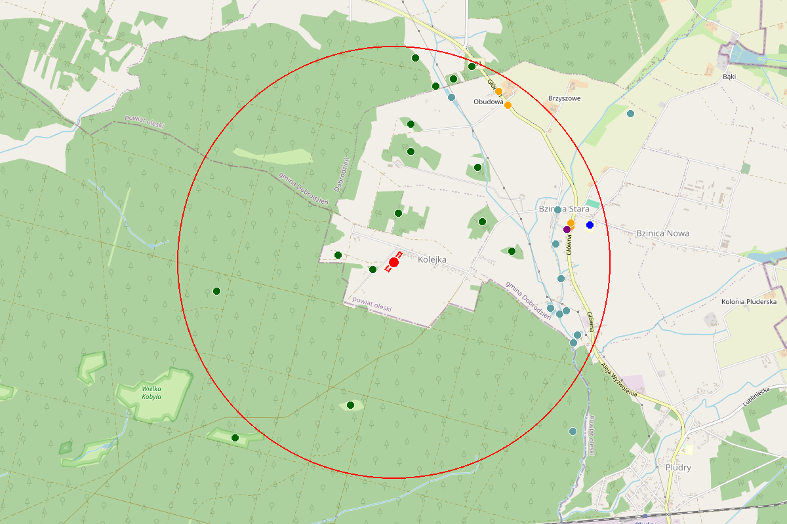

# plot-finder


> Python library to find Polish land parcels and analyze their surroundings.

Query the [ULDK (GUGiK)](https://uldk.gugik.gov.pl/) API to get parcel data by TERYT ID or coordinates, then analyze nearby infrastructure using OpenStreetMap.



## Installation

```bash
pip install plot-finder           # base
pip install plot-finder[viz]      # + interactive maps & PNG export
```

**Requirements:** Python 3.10+ | `pydantic` `httpx` `shapely` `pyproj`

## Quick Start

```python
from plot_finder import Plot, PlotAnalyzer, PlotReporter

# Find a parcel
plot = Plot(plot_id="141201_1.0001.6509")
print(plot.voivodeship)  # mazowieckie
print(plot.centroid)     # (x, y)

# Analyze surroundings
analyzer = PlotAnalyzer(plot, radius=3000)

for place in analyzer.education():
    print(f"{place.name} — {place.distance_m}m, walk {place.walk_min}min")

# Full report
report = PlotReporter(analyzer).report()
report.model_dump_json()

# Visualization (pip install plot-finder[viz])
from plot_finder.visualizer import PlotVisualizer
viz = PlotVisualizer(report)
viz.save("map.html")  # interactive map
viz.save("map.png")   # static image
```

## Documentation

| Page | Description |
|------|-------------|
| [Plot](docs/plot.md) | Finding parcels by TERYT ID or coordinates |
| [PlotAnalyzer](docs/analyzer.md) | Analyzing surroundings (education, shops, transport, etc.) |
| [Air Quality](docs/air.md) | Air pollution data (OpenWeatherMap API) |
| [Sunlight](docs/sun.md) | Sunrise, sunset, daylight hours |
| [Place](docs/place.md) | Result model with travel times |
| [Report](docs/report.md) | Full structured report (PlotReporter) |
| [Visualizer](docs/visualizer.md) | Interactive HTML maps & static PNG images |
| [API Reference](docs/api.md) | Full API reference |
| [Errors](docs/errors.md) | Exception handling and hierarchy |

## License

MIT — use it however you want.
